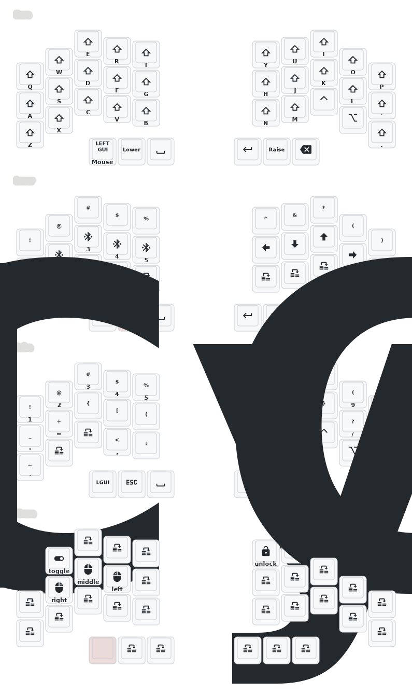

Carrying over my OSM's from QMK to ZMK.

### Colemak-DH, 6 layer, no-lag from homerow mods, inspired by callum's OSM

Note: '$west update' must be run inside .zmk/ workspace after cloning. This is a standard ZMK local build step. (Dependency declared in west.yml)
.zmk/ is gitignored and must be initialized with west init & west update.

